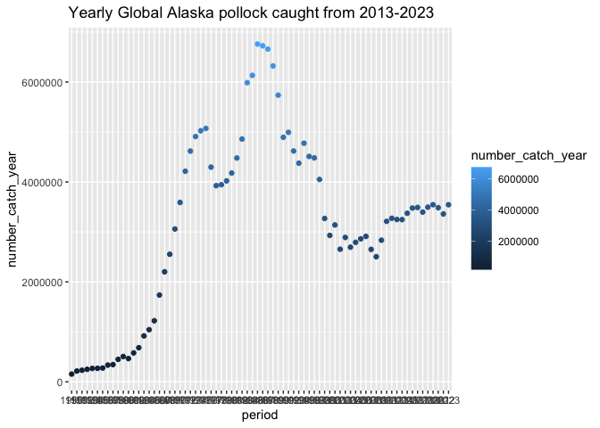
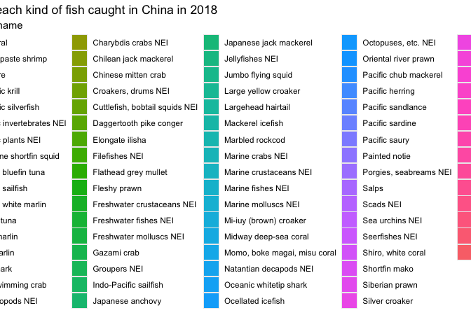

## Instructions
Answer the following questions and/or complete the exercises in RMarkdown. Please embed all of your code and push the final work to your repository. Your report should be organized, clean, and run free from errors. Remember, you must remove the `#` for any included code chunks to run.  

## Load the libraries

``` r
library("tidyverse")
library("janitor")
library("naniar")
options(scipen = 999)
```

## About the Data
For this assignment we are going to work with a data set from the [United Nations Food and Agriculture Organization](https://www.fao.org/fishery/en/collection/capture) on world fisheries. These data were downloaded and cleaned using the `fisheries_clean.Rmd` script.  

Load the data `fisheries_clean.csv` as a new object titled `fisheries_clean`.

``` r
fisheries_clean <- read_csv("data/fisheries_clean.csv")
```

1. Explore the data. What are the names of the variables, what are the dimensions, are there any NA's, what are the classes of the variables, etc.? You may use the functions that you prefer.

``` r
names(fisheries_clean)
```

```
## [1] "period"          "continent"       "geo_region"      "country"        
## [5] "scientific_name" "common_name"     "taxonomic_code"  "catch"          
## [9] "status"
```

``` r
anyNA(fisheries_clean)
```

```
## [1] TRUE
```

``` r
str(fisheries_clean)
```

```
## spc_tbl_ [1,055,015 × 9] (S3: spec_tbl_df/tbl_df/tbl/data.frame)
##  $ period         : num [1:1055015] 1950 1951 1952 1953 1954 ...
##  $ continent      : chr [1:1055015] "Asia" "Asia" "Asia" "Asia" ...
##  $ geo_region     : chr [1:1055015] "Southern Asia" "Southern Asia" "Southern Asia" "Southern Asia" ...
##  $ country        : chr [1:1055015] "Afghanistan" "Afghanistan" "Afghanistan" "Afghanistan" ...
##  $ scientific_name: chr [1:1055015] "Osteichthyes" "Osteichthyes" "Osteichthyes" "Osteichthyes" ...
##  $ common_name    : chr [1:1055015] "Freshwater fishes NEI" "Freshwater fishes NEI" "Freshwater fishes NEI" "Freshwater fishes NEI" ...
##  $ taxonomic_code : chr [1:1055015] "1990XXXXXXXX106" "1990XXXXXXXX106" "1990XXXXXXXX106" "1990XXXXXXXX106" ...
##  $ catch          : num [1:1055015] 100 100 100 100 100 200 200 200 200 200 ...
##  $ status         : chr [1:1055015] "A" "A" "A" "A" ...
##  - attr(*, "spec")=
##   .. cols(
##   ..   period = col_double(),
##   ..   continent = col_character(),
##   ..   geo_region = col_character(),
##   ..   country = col_character(),
##   ..   scientific_name = col_character(),
##   ..   common_name = col_character(),
##   ..   taxonomic_code = col_character(),
##   ..   catch = col_double(),
##   ..   status = col_character()
##   .. )
##  - attr(*, "problems")=<externalptr>
```

2. Convert the following variables to factors: `period`, `continent`, `geo_region`, `country`, `scientific_name`, `common_name`, `taxonomic_code`, and `status`.

``` r
fisheries_clean <- fisheries_clean %>% 
  mutate(across(where(is.character),as.factor)) %>% 
  mutate(across(period,as.factor))
```


``` r
fisheries_clean
```

```
## # A tibble: 1,055,015 × 9
##    period continent geo_region    country     scientific_name common_name       
##    <fct>  <fct>     <fct>         <fct>       <fct>           <fct>             
##  1 1950   Asia      Southern Asia Afghanistan Osteichthyes    Freshwater fishes…
##  2 1951   Asia      Southern Asia Afghanistan Osteichthyes    Freshwater fishes…
##  3 1952   Asia      Southern Asia Afghanistan Osteichthyes    Freshwater fishes…
##  4 1953   Asia      Southern Asia Afghanistan Osteichthyes    Freshwater fishes…
##  5 1954   Asia      Southern Asia Afghanistan Osteichthyes    Freshwater fishes…
##  6 1955   Asia      Southern Asia Afghanistan Osteichthyes    Freshwater fishes…
##  7 1956   Asia      Southern Asia Afghanistan Osteichthyes    Freshwater fishes…
##  8 1957   Asia      Southern Asia Afghanistan Osteichthyes    Freshwater fishes…
##  9 1958   Asia      Southern Asia Afghanistan Osteichthyes    Freshwater fishes…
## 10 1959   Asia      Southern Asia Afghanistan Osteichthyes    Freshwater fishes…
## # ℹ 1,055,005 more rows
## # ℹ 3 more variables: taxonomic_code <fct>, catch <dbl>, status <fct>
```

3. Are there any missing values in the data? If so, which variables contain missing values and how many are missing for each variable?

``` r
summary(fisheries_clean)#no missing values.
```

```
##      period          continent                geo_region    
##  2016   : 21145   Africa  :135378   Southern Europe:147073  
##  2017   : 21071   Americas:208588   Eastern Asia   :111354  
##  2019   : 21063   Asia    :232716   Northern Europe:104406  
##  2018   : 20891   Europe  :388682   Eastern Europe : 69201  
##  2013   : 20810   Oceania : 65840   Western Europe : 68002  
##  2015   : 20589   NA's    : 23811   (Other)        :531168  
##  (Other):929446                     NA's           : 23811  
##                      country                 scientific_name  
##  Spain                   : 61758   Actinopterygii    : 29467  
##  United States of America: 44356   Thunnus albacares : 15873  
##  Portugal                : 40903   Osteichthyes      : 14800  
##  Japan                   : 38574   Thunnus obesus    : 14746  
##  Republic of Korea       : 37179   Xiphias gladius   : 14385  
##  France                  : 31087   Katsuwonus pelamis: 13938  
##  (Other)                 :801158   (Other)           :951806  
##                 common_name             taxonomic_code       catch           
##  Marine fishes NEI    : 25392   1990XXXXXXXX110: 25392   Min.   :       0.0  
##  Yellowfin tuna       : 15873   152511107002   : 15873   1st Qu.:       0.0  
##  Freshwater fishes NEI: 14800   1990XXXXXXXX106: 14800   Median :       2.9  
##  Bigeye tuna          : 14746   152511107005   : 14746   Mean   :    5089.9  
##  Swordfish            : 14385   155526101001   : 14385   3rd Qu.:     400.0  
##  (Other)              :966973   152511104201   : 13938   Max.   :12277000.0  
##  NA's                 :  2846   (Other)        :955881                       
##  status    
##  A:985772  
##  E:   587  
##  I: 36368  
##  N: 32012  
##  Q:   276  
##            
## 
```

4. How many countries are represented in the data?

``` r
fisheries_clean %>% 
  summarise(n_distinct(country))
```

```
## # A tibble: 1 × 1
##   `n_distinct(country)`
##                   <int>
## 1                   249
```

5. The variables `common_name` and `taxonomic_code` both refer to species. How many unique species are represented in the data based on each of these variables? Are the numbers the same or different?

``` r
fisheries_clean %>% 
  summarise(n_unique_commonname=n_distinct(common_name),
            n_unique_taxonomiccode=n_distinct(taxonomic_code))
```

```
## # A tibble: 1 × 2
##   n_unique_commonname n_unique_taxonomiccode
##                 <int>                  <int>
## 1                3390                   3722
```

6. In 2023, what were the top five countries that had the highest overall catch?

``` r
fisheries_clean %>% 
  filter(period=="2023") %>% 
  group_by(country) %>% 
  summarise(number_catch_country=sum(catch,na.rm=T)) %>% 
  arrange(desc(number_catch_country))#top five is China,Indonesia,India,Russian Federation,United States of America.
```

```
## # A tibble: 238 × 2
##    country                  number_catch_country
##    <fct>                                   <dbl>
##  1 China                               13424705.
##  2 Indonesia                            7820833.
##  3 India                                6177985.
##  4 Russian Federation                   5398032 
##  5 United States of America             4623694 
##  6 Peru                                 3519381.
##  7 Viet Nam                             3417238.
##  8 Japan                                2904942.
##  9 Chile                                2596488.
## 10 Norway                               2546846.
## # ℹ 228 more rows
```

7. In 2023, what were the top 10 most caught species? To keep things simple, assume `common_name` is sufficient to identify species. What does `NEI` stand for in some of the common names? How might this be concerning from a fisheries management perspective?

``` r
fisheries_clean %>% 
  filter(period=="2023") %>% 
  group_by(common_name) %>% 
  summarise(number_catch_commonname=sum(catch,na.rm=T)) %>% 
  arrange(desc(number_catch_commonname))#top 10 show as below.
```

```
## # A tibble: 2,870 × 2
##    common_name                    number_catch_commonname
##    <fct>                                            <dbl>
##  1 Marine fishes NEI                             8553907.
##  2 Freshwater fishes NEI                         5880104.
##  3 Alaska pollock(=Walleye poll.)                3543411.
##  4 Skipjack tuna                                 2954736.
##  5 Anchoveta(=Peruvian anchovy)                  2415709.
##  6 Blue whiting(=Poutassou)                      1739484.
##  7 Pacific sardine                               1678237.
##  8 Yellowfin tuna                                1601369.
##  9 Atlantic herring                              1432807.
## 10 Scads NEI                                     1344190.
## # ℹ 2,860 more rows
```

8. For the species that was caught the most above (not NEI), which country had the highest catch in 2023?

``` r
fisheries_clean %>% 
  filter(period=="2023",common_name=="Alaska pollock(=Walleye poll.)") %>% 
  group_by(country) %>% 
  summarise(number_catch_country=sum(catch,na.rm=T)) %>% 
  arrange(desc(number_catch_country))#Russian Federation
```

```
## # A tibble: 6 × 2
##   country                               number_catch_country
##   <fct>                                                <dbl>
## 1 Russian Federation                                1893924 
## 2 United States of America                          1433538 
## 3 Japan                                              122900 
## 4 Democratic People's Republic of Korea               58730 
## 5 Republic of Korea                                   28432.
## 6 Canada                                               5887.
```

9. How has fishing of this species changed over the last decade (2013-2023)? Create a  plot showing total catch by year for this species.

``` r
fisheries_clean %>% 
  filter(common_name=="Alaska pollock(=Walleye poll.)") %>% 
  group_by(period) %>% 
  summarise(number_catch_year=sum(catch,na.rm=T)) %>% 
  ggplot(mapping = aes(x=period,y=number_catch_year))+
  geom_point(mapping =aes(color=number_catch_year) )+
  labs(title="Yearly Global Alaska pollock caught from 2013-2023")
```

<!-- -->

10. Perform one exploratory analysis of your choice. Make sure to clearly state the question you are asking before writing any code.

``` r
fisheries_clean %>% 
  filter(period=="2018",country=="China") %>% 
  ggplot(mapping = aes(x=common_name))+
  geom_bar(mapping = aes(fill=common_name))+
  labs(title = "number of each kind of fish caught in China in 2018")
```

<!-- -->

## Knit and Upload
Please knit your work as an .html file and upload to Canvas. Homework is due before the start of the next lab. No late work is accepted. Make sure to use the formatting conventions of RMarkdown to make your report neat and clean!  
